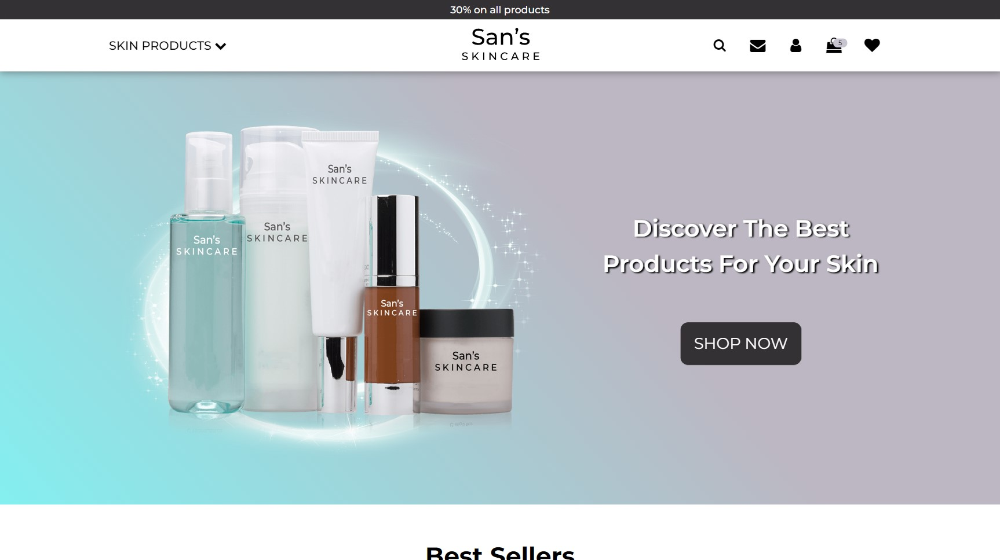
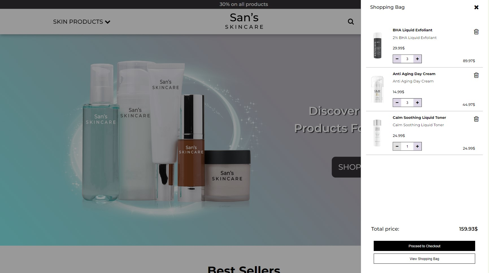

# **San's SkinCare - E-commerce Web**

**San's SkinCare** is a responsive e-commerce website created as my first school project.
The project features a fictional skincare brand where users can browse products, add items to their shopping cart, and mark favorites.
It showcases essential web development skills using **HTML**, **CSS**, and **JavaScript**.

## **Technologies Used**

- **HTML**: Structuring the layout of the web pages.
- **CSS**: Styling the web pages, with responsiveness in mind.
- **JavaScript**: Adding interactivity for features like shopping cart, favorites, and navigation.

## Screenshots

### Homepage

## **Current Status**

Features that are **Not Working**
- **Search Button**: The search functionality is currently not implemented.
- **Contact Page**: The contact form is not functional at this time.
- **Sign In**: User authentication and sign-in are not yet implemented.
- **Checkout**: The checkout process is incomplete, and users cannot proceed to purchase items.

## Installation

1. **Download the Repository**.
2. **Extract the ZIP File**: Extract the contents to a folder on your computer.
3. **Open the Website**: Navigate to the extracted folder and open Index.html.
